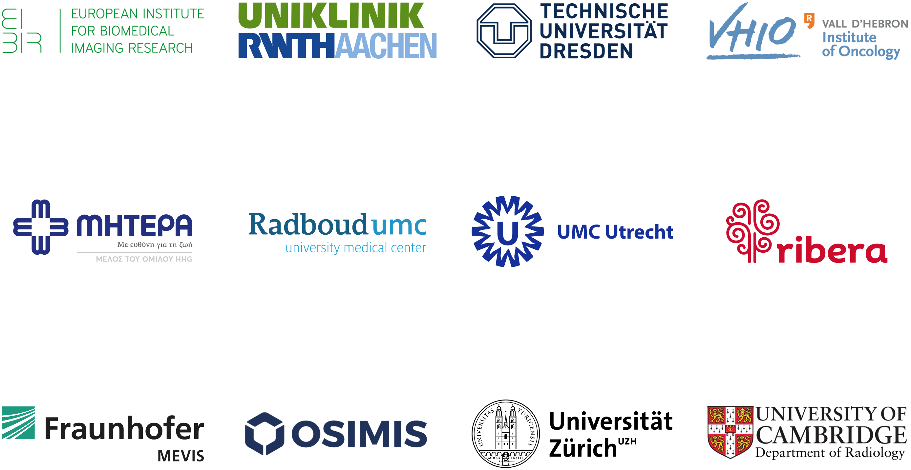

# The Project

!!! info
    This website provides **technical instructions** how to **set up and reuse** the Odelia technical platform for other use cases. The official Odelia website, which introduces the consortium, can be found here: [odelia.ai](https://odelia.ai/)

## Mission

ODELIA’s mission is to develop and implement a **pan-European swarm learning network** that enables **privacy-preserving and democratic training** of **medical AI** algorithms. By focusing on breast cancer detection in MRI screenings, the project aims to demonstrate the power of **swarm learning** and its potential applications in various clinical settings.

!!! quote "Prof. Jakob N. Kather, Scientific Coordinator, EKFZ for Digital Health"
    Swarm Learning has the potential to address the challenges of data collection and providing a framework for collaboration in AI training and ultimately improve the quality of healthcare for patients in Europe.

## Vision for the Future

ODELIA envisions a future where **swarm learning becomes a standard practice in the development of medical AI models, ensuring data privacy and fostering collaboration among healthcare institutions**. The project aspires to pave the way for a new era of AI-driven medical advancements that empower healthcare providers and improve patient outcomes across Europe and beyond.

## Project Context

In a rapidly evolving healthcare landscape, the need for advanced **AI-driven solutions** and **secure data sharing** has become increasingly important. ODELIA tackles these challenges by harnessing the **power of swarm learning**, providing a **decentralized, privacy-preserving approach** to AI model training. By addressing the limitations of traditional AI training methods, ODELIA paves the way for **improved diagnostic accuracy and enhanced collaboration** among healthcare providers. The project focuses on the critical area of breast cancer detection in MRI screenings, demonstrating the real-world impact of swarm learning on patient outcomes and advancing the field of **medical AI**.

!!! quote "Dr. Daniel Truhn, Scientific Coordinator, RWTH Aachen"
	ODELIA is a pioneering project that brings together the best of AI, medical imaging, and data privacy. I am proud to be part of this collaborative effort to transform healthcare. As a radiologist, I believe our swarm learning approach will revolutionize medical AI and set new standards in privacy-preserving AI development to advance healthcare.

## Partner

The ODELIA Consortium brings together a diverse and talented team of experts from **across Europe**. Comprising **12 partners from 8 countries**, our consortium represents a multidisciplinary collaboration of specialists in the fields of **medicine**, **artificial intelligence**, and **big data**: **European Institute for Biomedical Imaging Research** (Austria), **University Hospital Aachen** (Germany), **Vall d’Hebron Institute of Oncology** (Spain), **Mitera Hospita** (Greece), **Radboud University Medical Center** (Netherlands),** University Medical Center Utrecht** (Netherlands), **Ribera Salud** (Spain), **Fraunhofer Institute for Digital Medicine MEVIS** (Germany), **OSIMIS** (Belgium), **Technische Universität Dresden** (Germany), **University of Zurich** (Switzerland) and **University of Cambridge** (United Kingdom).

{ width: 100%; align=center }

## Funding

This project has received funding from the European Union’s Horizon Europe research and innovation programme under grant agreement No 101057091.

